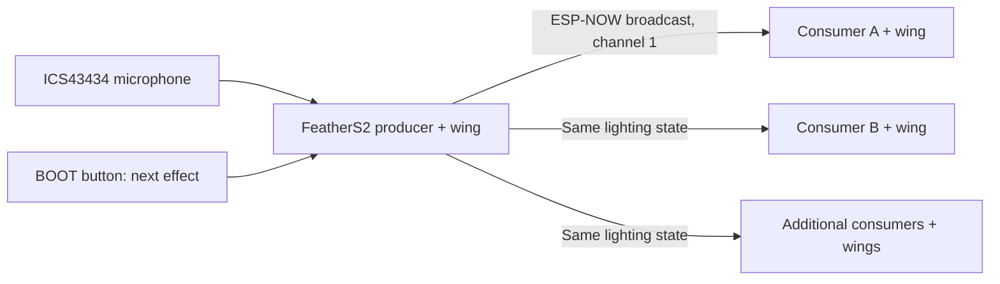

# Digirdu Lights

Expressive didgeridoo lighting for an **Unexpected Maker FeatherS2**, an
**ICS43434 I2S microphone**, and **32-pixel NeoPixel FeatherWings**. The local
wing previews a ~100-foot culvert with the player at its midpoint. Additional
ESP32/wing nodes receive musical features wirelessly over **ESP-NOW**.
Brightness is capped at **15%**, including overlapping visual layers. Audio
stays in RAM; only normalized features and animation state are transmitted.

## What the playing controls

All layers operate simultaneously; there is no exclusive “current instrument”
mode and no spectrum-bar display.

| Component | Measurement | Visual response |
| --- | --- | --- |
| Drone | 45–180 Hz energy above background, concentrated low peak and pitch stability | Slow, sustained field extending in both directions |
| Harmonics / timbre | Relative 180–1000 Hz energy; 150–1000 Hz centroid and formant balance | Field hue, spacing and motion change at constant loudness |
| Growl | Relative low/mid energy × flatness, spectral change/modulation and spread | Rolling, irregular colored texture within the drone |
| Vocal | 700–3500 Hz share of total energy AND ratio to drone, plus spectral baseline excess | Brighter moving ribbons; strong onset launches a broader pulse |
| Attack | Positive spectral flux plus relative broadband RMS rise | Short pulses traveling outward from the player |
| Silence / decay | Activity hysteresis and separate release envelopes | Lingering light and trails that gradually fade to black |

These are acoustic **heuristics**, not voice identification. Resonance, vocal
formants and noisy articulations overlap. The intensity values express acoustic
character, not guaranteed classifications or source separation. Tune them while
playing the actual instrument in the culvert. A single microphone cannot tell
a fresh articulation from every strong reflected copy of it.

## Signal path and feature interface

`audio_spectrum.py` uses native `ulab` FFT operations, a **1024-sample Hann
window**, DC removal, **16 kHz** signed input and **1024-sample hops** (contiguous, non-overlapping windows).
The nominal update interval and analysis window are **64 ms**, with
15.625 Hz bin spacing. A 512-sample FFT, half-window overlap, or 22.05 kHz is also
configurable; re-run the hardware benchmark before using a shorter hop. Band edges select FFT bins; they are not brick-wall filters.
The low peak estimate is coarse, not a precision pitch tracker.

Initial energy bands: 45–180, 180–450, 450–1000, 1000–3500 and 3500–8000 Hz.
Power is normalized for the Hann window. Broadband RMS is computed from all
FFT power using Parseval's identity, so it is a DC-removed, Hann-weighted RMS.
The separate mic diagnostic reports unwindowed time-domain RMS. Spectral flux uses positive magnitude
changes normalized by frame magnitude; shape flux compares normalized spectral
shapes. By default, noisiness uses the participation ratio in 180–3500 Hz:
`(sum(power)**2 / sum(power**2))` estimates how many bins carry energy, then
removes the Hann footprint of a tone and normalizes to a noise-like spectrum.
This avoids hundreds of logarithms per frame on the ESP32-S2. Set
`roughness_metric="flatness"` for geometric/arithmetic mean power instead, and
check timing again. The diagnostic `flatness` field holds the selected
noisiness measure. Modulation
tracks changes in the *relative* low/mid energy, so scaling volume alone does
not define growl.

`Analyzer.update(raw, dt)` returns a reused `AudioFeatures` object with:

```python
volume, drone, harmonics, timbrePosition, growl, vocal
roughness, centroid, attack, decay                 # all 0..1
attackEvent, yellEvent                            # one-frame booleans
active, calibrating, clipped                      # state/diagnostics
rms, noiseFloor, bandEnergy, bandRatio, flux, flatness, modulation
fundamentalHz                                    # coarse low-band peak, or 0
```

Copy values if retaining history: the object is updated in place. Consume event
flags once per analysis frame. `attack` holds the event strength, then releases.
Drone, growl and vocal envelopes have separate attack/release times. Timbre and
centroid retain their last positions through silence while light decays.

Calibration uses the lower 20th percentile of the first two seconds (excluding
mic startup). Keep those two seconds quiet. Background rises over 120 seconds
only near the existing noise floor, and falls over four seconds. Foreground
frames cannot immediately raise it. The playing-level reference rises over
12 seconds, falls over 45 seconds, and caps an observation's influence before
updating. Vocal baseline learning freezes during strong vocal activity.
Events use hysteresis, cooldowns and a decaying previous-event level to reduce
repeat triggers from weaker echoes. Calibration and detected capture gaps
suppress onset events briefly.

## FeatherS2 wiring

Disconnect power before changing wiring. These are **GPIO numbers**: Feather
D-number aliases do not necessarily match them.

| Connection | FeatherS2 pin | CircuitPython name |
| --- | --- | --- |
| Mic BCLK / SCK | GPIO 5 | `board.IO5` |
| Mic LRCLK / WS | GPIO 6 | `board.IO6` |
| Mic DOUT / SD | GPIO 9 | `board.IO9` |
| Mic SEL / LR | GND | Left channel selected |
| Mic 3V / VDD | 3.3V | Use the main 3V3 supply |
| Mic GND | GND | Shared ground |
| Wing data, factory jumper | GPIO 38 | `board.IO38` |
| Wing power | Feather USB/BAT and GND headers | Aligned, soldered headers |

The mic uses standard I2S, 32-bit slots carrying 24-bit signed samples,
16 kHz sampling, and the left channel. CircuitPython converts capture to
signed 16-bit samples for level measurements. GPIO 9 is also the SCL pin:
do not use I2C/STEMMA devices on that pin while this mic is connected.
The FeatherS2 onboard APA102 status LED is separate from the FeatherWing.
The wing's default jumper occupies the standard Feather M0 D6 header position,
which maps to **GPIO 38** on FeatherS2. Do not use FeatherS2's `board.D6` alias:
it maps to GPIO 3 at a different physical position and leaves this wing dark.

## Setup and firmware

Host requirements: Python 3.10+, `make`, `curl`, USB data cable. Tools install
into `.venv`; no extra CircuitPython library bundle is needed by this app.
`make check` additionally needs Python 3.10–3.13 for the pinned NumPy version.
The pinned firmware is **CircuitPython 10.3.1 for `unexpectedmaker_feathers2`**.
The Adafruit ESP32-S2 Feather and FeatherS2 Neo use different firmware.

```sh
make setup
make ports
make firmware       # Download the correct .uf2
```

The connected FeatherS2 initially had CircuitPython **6.2.0-beta.1** from 2021.
That version needs upgrading for the `audioi2sin.I2SIn` API used here. Its
existing app and libraries were backed up to
`.artifacts/feathers2-files-1789493704704278000/` before the upgrade.

For future firmware upgrades, first back up the files on `CIRCUITPY`. Enter
the UF2 loader: press Reset, then press Boot when the onboard RGB LED turns
purple. The drive is normally called **FTHRS2BOOT**.
Older loaders may show no purple: press Reset, wait about one second, then
press Boot. Their drive may be called **UFTHRS2BOOT**; both names are supported.
Once that drive appears, run:

```sh
make flash
```

The FeatherS2 target copies the official UF2 to the identified bootloader drive.
It does not erase the entire flash. Wait for **CIRCUITPY** to reappear. If no
bootloader drive appears, consult the manufacturer's recovery instructions
linked below; do not use the old ESP32 board's flash command on this board.

### Older boards without a working UF2 loader

Hold **BOOT**, tap **RESET**, then release BOOT. If the recovery USB port does
not appear, unplug USB and reconnect it while holding BOOT, then release BOOT.
This uses the chip's built-in ROM loader and does not require a purple LED.

```sh
make ports
make flash-rom      # Checks ESP32-S2/16 MB, backs up flash, ERASES, writes .bin
```

Tap Reset after flashing if instructed. This installs CircuitPython directly;
it does not install the optional TinyUF2 loader. Use `make flash-rom` for later
firmware reinstalls if no FTHRS2BOOT drive is available. Routine app changes
still use only `make deploy`. Firmware and full flash backups stay in
`.artifacts/` and are ignored by Git.

## Deploy and test

```sh
make check
make deploy
make test-mic
make benchmark
make console
```

`make deploy` automatically identifies supported boards from CircuitPython's
board ID: FeatherS2 uses GPIO 38 and its matched CIRCUITPY drive; Adafruit
Feather ESP32 V2 (HUZZAH32 V2) uses GPIO 32 and serial file transfer. Both get
the same ten application/configuration files. An unknown model stops before
writing; add and verify its hardware profile before deploying to it. Use
`BOARD=...` to require a specific model. Firmware installation still requires
an explicit board choice for anything other than the default FeatherS2.

Deployment stops the app, backs up existing application files under
`.artifacts/`, stages uploads, verifies readback, and restarts. Startup checks require audio-level output (leader)
or a running render loop (follower), with no traceback. Existing `node_config.py` is preserved unless `NODE_CONFIG=...`
is supplied explicitly. A level log alone cannot establish that the microphone responds
to sound; compare quiet and clap levels and watch the LEDs.

Keep the room quiet for the **first two seconds** after startup to calibrate
the noise floor. Then play a steady drone, change mouth/tongue position, add a
growl, vocalize, and try hard DOOTs. Watch both the feature logs and the lights.

`make test-mic` captures ten seconds with the LEDs off, prints RMS (average
signal strength), peak, and sample span, then resumes the app. Stay quiet at
first and clap during the test. The maximum RMS should exceed the quiet level;
constant zero/span-zero data indicates a wiring or power problem. These are
relative digital levels, not calibrated sound-pressure decibels.

`make benchmark` measures five seconds of live capture, FFT, rendering and radio
sending with LEDs off, reports mean/max work time, overruns and discontinuities,
then resumes the app. Work should fit in the hop interval. The ESP32-S2 I2S
driver does not expose every DMA overflow; a good timing result is not proof
that no samples were ever dropped. Long capture gaps reset FFT overlap and
suppress false onsets. Processing overruns are logged.

`make console` shows `AUDIO rms=... drone=... growl=... vocal=...` plus
`ATTACK strength=...` and `YELL vocal=...` lines. `clip=True` means the microphone
PCM is saturating; software gain cannot recover the lost waveform.
Ctrl-C stops the app and turns off the wing, Ctrl-D restarts/calibrates it,
and Ctrl-] closes the console. Close other serial terminals before deployment.

For multiple boards or a differently named mount:

```sh
make deploy PORT=/dev/cu.usbmodem... MOUNT=/Volumes/CIRCUITPY
# Linux example: PORT=/dev/ttyACM0 MOUNT=/media/yourname/CIRCUITPY
```

## Tune the installation

Defaults live in `config.py`; put per-node changes in an `OVERRIDES` dictionary
in a node profile, then run `make deploy NODE_CONFIG=path/to/profile.py`. Routine
`make deploy` preserves the configuration already saved on that board. Important groups:

- **Capture:** `sample_rate`, `fft_size`, `hop_size`, `bands`, `timbre_band`,
  `vocal_band`, `roughness_band`, `gain`. Use full-window hops on this FeatherS2 for processing headroom; half-window
  hops are available for faster boards. At 22.05 kHz,
  extend the high band's upper edge to 11025 Hz.
- **Background:** `calibration_s`, `min_noise_rms`, `noise_rise_s`,
  `noise_fall_s`, `noise_learn_ratio`, activity ratios and `silence_hold_s`.
- **Dynamics:** `level_initial`, `level_rise_s`, `level_fall_s`,
  `adaptation_limit`, and each feature's attack/release times.
- **Growl:** `mid_ratio`, `flatness_range`, `modulation_range`,
  `shape_flux_range`, `roughness_weights`, `spread_hz`, `roughness_metric`,
  `noise_tonal_bins`, `noise_expected_fill`.
- **Vocal:** `vocal_total_ratio`, `vocal_drone_ratio`, `vocal_excess_range`,
  `yell_on/off`, `yell_rise`, `yell_cooldown_s`.
- **Attacks/echoes:** flux/rise ranges, `attack_on/off`, cooldown,
  `echo_memory_s` and `echo_event_ratio`. Higher echo rejection can also miss
  intentionally softer repeated articulations.
- **Visuals:** hue/timbre span, wave speed/spacing, pulse speed/width,
  `decay_s`, `trail_s`, and per-pixel coordinates. Keep `brightness=0.15`.

Start with a quiet reset. Play the same drone softly and loudly: `drone` should
persist and `vocal` should stay low. Move mouth/tongue position at similar level:
`timbrePosition` should move. Add a growl: adjust texture thresholds before gain.
Add vocals: tune the two energy-ratio ranges before `yell_on`. Finally stop and
listen to the culvert tail while adjusting `decay_s` and echo rejection. Do not
calibrate during continuous playing. Flat data for two seconds stops the app
with an explicit wiring error and clears the wing.

## Multiple wireless FeatherWings

Each wireless node needs an ESP32 and local power for its FeatherWing. Wings
alone do not contain a radio. The current mic board is the **producer** (internally `leader`); consumers
(internally `follower`)
render the transmitted features without initializing a microphone. Consumers support **FeatherS2 GPIO 38** and **Adafruit Feather ESP32 V2 GPIO 32**.
The board ID selects the verified pin automatically. The ESP32 V2 profile is
consumer-only; microphone wiring is configured on FeatherS2.

ESP-NOW uses a common 2.4 GHz channel (default 1), without a router, Wi-Fi login,
or internet connection. Don't also connect the nodes to a Wi-Fi access point,
which can change their channel. The sender broadcasts version-2, 43-byte packets at up to ~16 updates/second. Packets contain feature envelopes, scene
time/phase, the selected effect ID, a boot/session ID, sequence number, and recent event counters,
strengths and ages. Receivers filter the configured leader MAC and group, reject
duplicate/out-of-order packets, and recover a recent event if one packet is
lost. Broadcasts are unencrypted; MAC/group filtering avoids mixing installations
but is not authentication. Only lighting state is sent, never audio.

A follower starts dark until it receives valid state. After 0.5 seconds without
valid packets it releases the last state over `decay_s`; it does not freeze
bright or abruptly switch off. Scene phase is refreshed on receipt, providing
approximate visual synchronization, not sample-accurate clock synchronization.
Radio range and reception inside the culvert require a real multi-node test.

### How connections work



There is no pairing button, network password, connection handshake, or consumer
registration. Power the producer and any configured consumers; each consumer
listens independently for the producer's broadcasts. Adding another consumer
does not add another transmit stream. Consumers do not relay packets, so each
must be within radio reach of the producer. This is one producer broadcasting
to many consumers, not a mesh. Every node needs local power.

| Setting | What must match |
| --- | --- |
| `radio_channel` | Same 2.4 GHz channel on all nodes; default 1 |
| `radio_group` | Same installation number on all nodes; default 1 |
| `leader_mac` | Consumers accept the microphone board's MAC, currently `7c:df:a1:03:4c:2c` |
| `radio_role` | One `producer`; all other nodes `consumer` |
| Firmware/protocol | Deploy this application version to all nodes |
| `pixel_positions` | May differ per wing to locate it in the shared scene |

To test: power both boards, keep quiet through producer calibration, then clap
or play. On the consumer, `LIGHTS ... received=... link=live` should show an
increasing receive count. Press the producer's BOOT button for about 0.2 seconds;
the consumer's `effect=` should change too. If reception stays at zero, check
producer power, matching MAC/channel/group, and distance. If packets arrive but
the wing stays dark while playing, check the wing data jumper and local power.
Silence normally fades the lighting to black.

### Saved roles and joining

The same application runs on all nodes. A new node defaults to **consumer**;
its saved `node_config.py` selects the role. We deliberately do not auto-detect
producer status from microphone noise: an unconnected data pin can produce
nonzero samples. An explicit producer profile avoids multiple accidental
producers. Role and coordinates survive reset and routine app updates.

For the known microphone board:

```sh
make deploy NODE_CONFIG=examples/node_producer.py
make test-mic
```

For each new **FeatherS2 or Feather ESP32 V2 consumer**, connect it over USB,
edit a copy of the consumer example with that wing's coordinates, and deploy:

```sh
make deploy NODE_CONFIG=examples/node_follower.py
# Optional model enforcement for the HUZZAH/Feather ESP32 V2:
make deploy BOARD=adafruit_feather_esp32_v2 NODE_CONFIG=examples/node_follower.py
```

With multiple USB boards, select the consumer's port. For FeatherS2, also
select its matching CIRCUITPY mount if needed:

```sh
make deploy NODE_CONFIG=examples/node_follower.py PORT=/dev/cu.usbmodem... MOUNT=/Volumes/CIRCUITPY
```

Then use `make deploy` without `NODE_CONFIG` for ordinary software updates.
The producer's state is broadcast, so multiple powered consumers can join at
once without being added to a peer list. A newly joining consumer picks up the
current effect from the next accepted packet. Broadcast has no per-consumer
acknowledgement; a successful send does not prove that every wing received it.

The known producer MAC is `7c:df:a1:03:4c:2c`. Match `leader_mac`, `radio_group`
and `radio_channel` on consumers. `make console` reports MAC, role and link state.
Use `radio_role="off"` for a local audio preview without transmitting. Profiles
accept `producer`/`consumer` as well as the internal `leader`/`follower` names.

### Effect library and BOOT button

Press and release **BOOT** while the producer is running to advance:

| ID | Effect | Character |
| --- | --- | --- |
| 0 | Culvert | Spacious blue/green traveling drone field |
| 1 | Ember | Warm, broad waves and stronger growl texture |
| 2 | Aurora | Cooler, tighter waves and wide vocal pulses |
| 3 | Ripple | Dimmer atmosphere emphasizing narrow outward attacks |

A brief palette preview confirms changes even during silence. Button presses
are debounced and holding the button does not auto-repeat. The selected effect
is included in **every** radio update, so a missed button-change packet is
corrected by the next one; consumers do not need their own button. Scene state
and trailing light continue across effect changes. The initial effect after a
producer reset comes from `effect_index`; changes are not written to flash on
every button press.

BOOT connects GPIO 0 to ground. It is a normal readable input during the app,
with a special boot-selection role **at reset**: holding BOOT while resetting
enters the ROM download loader. For effect changes, press BOOT without RESET.
See [Espressif's boot-pin description](https://docs.espressif.com/projects/esptool/en/latest/esp32s2/advanced-topics/boot-mode-selection.html).
Use a deliberate ~0.2-second press so the audio loop can sample it twice.

For later external buttons, set `button_next_gpio` and optionally
`button_previous_gpio` in the producer profile. Each switch connects its GPIO
to GND; the app enables internal pull-ups. Set a pin to `None` to disable that
control. Keep GPIO 5/6/9 for the microphone and GPIO 38 for the wing.

Coordinates are `(axial, angle)` for each physical pixel: axial runs from -1 at
one end of the culvert through 0 at the player to +1 at the other end; angle is
0..1 turns around the circumference. The default wing previews the entire
length. Give each wireless wing its own coordinate interval to distribute the
field, or use identical positions for mirrored previews. The follower example
covers -0.6..-0.4. Pulse speed is artistic (half-lengths/second), not sound speed.
The default index order is a logical line; supply `pixel_positions` in actual
LED wiring order for a spatial 4×8 layout. Each wireless wing keeps 32 pixels;
do not multiply a node's count by the number of wireless nodes.

## Files and checks

- `code.py`: confirmed GPIOs, I2S capture, leader/follower loop, diagnostics.
- `config.py`, `node_config.py`: shared defaults and per-node overrides.
- `audio_spectrum.py`: window, FFT and spectral measurements.
- `audio_features.py`: simultaneous normalized features and event logic.
- `animation.py`, `effects.py`: native-array layered rendering, effect library,
  bounded pulse pool, trails and button debounce.
- `radio_protocol.py`, `wireless.py`: tested packet logic and ESP-NOW transport.
- `sound_reactive.py`: earlier helpers, retained for microphone diagnostics.
- `tests/`: generated PCM and packet-loss scenarios; no recorded audio.

`make check` installs pinned **NumPy 2.2.6** into `.venv` for host FFT tests.
Firmware uses built-in `ulab`; NumPy is never copied to the board. Tests exercise
silence/DC, band placement and RMS, drone frequency/volume variations, equal-RMS
timbre shifts, layered growl/vocal, onsets, normalization, release tails,
brightness bounds, pulse motion, coordinate mapping, packet loss/replay, and
deployment board selection/refusal before writes.

## Original Adafruit Feather ESP32 V2

This board now runs the shared ESP-NOW consumer app with ordinary `make deploy`.
It uses **GPIO 32** for the wing and has no CIRCUITPY USB drive. The previous
rainbow-only app is preserved in `examples/esp32_rainbow.py`; explicitly select
it with `LEGACY_RAINBOW=1`:

```sh
make deploy BOARD=adafruit_feather_esp32_v2 LEGACY_RAINBOW=1
make console BOARD=adafruit_feather_esp32_v2
```

Its firmware installation command is
`make flash BOARD=adafruit_feather_esp32_v2`. This command checks the 8 MB
ESP32-PICO-V3-02, backs up all flash, erases it, and installs CircuitPython.
At the reliable 115200 baud rate, allow about 13 minutes for the backup and
2–3 minutes for flashing. Use it only for firmware installation.

The original board's rainbow was deployed and visually confirmed on September
15, 2026. Its original 8 MB backup remains at
`.artifacts/flash-backup-1789492118517035000.bin`.

## Hardware history — September 15, 2026

- Identified ESP32-S2 revision 0.0, 16 MB flash, MAC `7c:df:a1:03:4c:2c`.
- Upgraded from CircuitPython 6.2.0-beta.1 to 10.3.1 through ROM recovery;
  esptool verified the written firmware hash. Holding BOOT while reconnecting
  USB successfully exposed the recovery port on this early board.
- Original full flash saved to `.artifacts/flash-backup-1789494748940767000.bin`;
  original app/library files also backed up separately before upgrading.
- Deployed both app files with readback verification. Microphone test measured
  RMS from **1.2 to 101.5**, with maximum sample span **434**. After restarting,
  a **144.5 RMS** spike triggered a beat and faster rainbow motion.
- The original five signal-processing tests and Python syntax checks passed.
- User reported the wing was completely dark with the initial GPIO 3 setting.
  Corrected the data pin to GPIO 38 by matching physical header positions;
  redeployment passed readback and serial startup checks on GPIO 38.
  User visually confirmed the corrected rainbow works and reacts to claps.

## Current didgeridoo validation

- 38 deterministic host tests pass; these use generated signals, not labelled
  didgeridoo recordings.
- Both the FeatherS2 producer and Feather ESP32 V2 consumer run CircuitPython
  10.3.1. The ESP32 V2 consumer's ten files passed serial readback and startup
  checks. Real ESP-NOW reception reached **94 accepted packets, zero rejected**
  over its first eight seconds, with `link=live` throughout. Consumer MAC:
  `14:33:5c:97:f2:a0`.
- Producer deployment passed file readback and serial startup checks. Native
  FFT verification placed a 93.75 Hz tone almost entirely in the drone band,
  with RMS 706.65 for a 1000-amplitude sine. Native packet decoding passed.
- A five-second live producer benchmark measured **14.3 frames/s**, mean work
  **59.1 ms**, maximum **97.7 ms**, and 20 overruns against the 64 ms hop budget.
  It sent 48 radio updates with no reported send errors. Work timing excludes
  blocking capture/copy time; this is not guaranteed gapless audio processing.
  The renderer's separate maximum-load check measured 20.2 ms per frame.
- The earlier clap-reactive rainbow was visually confirmed. The new musical
  layers and simultaneous visual effect changes still need user confirmation.
  Culvert classification accuracy and RF coverage are unmeasured.
- A later producer update was interrupted during temporary-file staging when
  USB was moved to the consumer. The producer retained its previously verified,
  protocol-compatible app; its broadcasts were received by the new consumer.
  The final shared source adds the ESP32 V2 pin profile without changing the
  producer's audio or radio behavior. Re-run ordinary `make deploy` on the
  producer next time it is connected to bring its source files up to date.

## References

- [FeatherS2 CircuitPython downloads](https://circuitpython.org/board/unexpectedmaker_feathers2/)
- [Unexpected Maker UF2 loader instructions](https://help.unexpectedmaker.com/docs/boards/uf2-bootloader-mode/)
- [FeatherS2 GPIO aliases](https://github.com/adafruit/circuitpython/blob/10.3.1/ports/espressif/boards/unexpectedmaker_feathers2/pins.c)
- [FeatherS2 physical pinout](https://feathers2.io/images/feathers2_pinout_extended2.jpg)
- [CircuitPython I2S microphone API](https://docs.circuitpython.org/en/latest/shared-bindings/audioi2sin/index.html)
- [TDK ICS43434 datasheet](https://invensense.tdk.com/wp-content/uploads/2016/02/DS-000069-ICS-43434-v1.2.pdf)
- [NeoPixel FeatherWing wiring](https://learn.adafruit.com/adafruit-neopixel-featherwing/pinouts)

- [ulab native spectrum utilities](https://micropython-ulab.readthedocs.io/en/latest/ulab-utils.html)
- [CircuitPython ESP-NOW API](https://docs.circuitpython.org/en/latest/shared-bindings/espnow/index.html)
