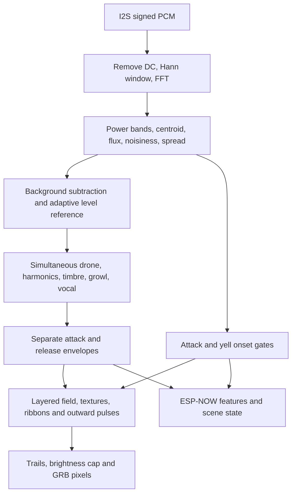
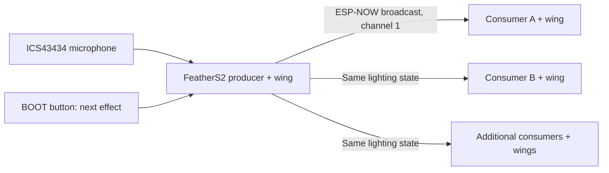

# Digirdu Lights

Expressive didgeridoo lighting for an **Unexpected Maker FeatherS2**, an
**ICS43434 I2S microphone**, and **32-pixel NeoPixel FeatherWings**. The local
wing previews a ~100-foot culvert with the player at its midpoint. Additional
ESP32/wing nodes receive musical features wirelessly over **ESP-NOW**.
Brightness is capped at **15%**, including overlapping visual layers. Audio
stays in RAM; only normalized features and animation state are transmitted.

## Planned OTA upgrades

[Review the OTA proposal](docs/ota-plan.md): GitHub releases, a separate Firebase
app, per-device HTTPS check-ins over open `openwireless.org`, and rollback.
This is a plan only; the current firmware remains ESP-NOW-only.

## What the playing controls

Effect 1 is an eight-band spectrum for microphone diagnostics. The other three
effects use the musical layers below simultaneously, with no exclusive
“current instrument” mode. See [spectrum display](#spectrum-display-effect-1).

| Component | Measurement | Visual response |
| --- | --- | --- |
| Drone | 45–180 Hz energy above background, concentrated low peak and pitch stability | Slow, sustained field extending in both directions |
| Harmonics / timbre | Relative 180–1000 Hz energy; 150–1000 Hz centroid and formant balance | Field hue, spacing and motion change at constant loudness |
| Growl | Relative low/mid energy × flatness, spectral change/modulation and spread | Rolling, irregular colored texture within the drone |
| Vocal | 700–3500 Hz share of total energy AND ratio to drone, plus spectral baseline excess | Brighter moving ribbons; strong onset launches a broader pulse |
| Attack | Positive spectral flux plus relative broadband RMS rise | Short pulses traveling outward from the player |
| Silence / decay | Activity hysteresis and separate release envelopes | Lingering light and trails that gradually fade to black |

These are acoustic **heuristics**, not voice identification. Resonance, vocal
formants and noisy articulations overlap. The intensity values express acoustic
character, not guaranteed classifications or source separation. Tune them while
playing the actual instrument in the culvert. A single microphone cannot tell
a fresh articulation from every strong reflected copy of it.

## Signal path and feature interface

`audio_spectrum.py` uses native `ulab` FFT operations, a **1024-sample Hann
window**, DC removal, **16 kHz** signed input and **1024-sample hops** (contiguous, non-overlapping windows).
The nominal update interval and analysis window are **64 ms**, with
15.625 Hz bin spacing. A 512-sample FFT, half-window overlap, or 22.05 kHz is also
configurable; re-run the hardware benchmark before using a shorter hop. Band edges select FFT bins; they are not brick-wall filters.
The low peak estimate is coarse, not a precision pitch tracker.

Initial energy bands: 45–180, 180–450, 450–1000, 1000–3500 and 3500–8000 Hz.
Power is normalized for the Hann window. Broadband RMS is computed from all
FFT power using Parseval's identity, so it is a DC-removed, Hann-weighted RMS.
The separate mic diagnostic reports unwindowed time-domain RMS. Spectral flux uses positive magnitude
changes normalized by frame magnitude; shape flux compares normalized spectral
shapes. By default, noisiness uses the participation ratio in 180–3500 Hz:
`(sum(power)**2 / sum(power**2))` estimates how many bins carry energy, then
removes the Hann footprint of a tone and normalizes to a noise-like spectrum.
This avoids hundreds of logarithms per frame on the ESP32-S2. Set
`roughness_metric="flatness"` for geometric/arithmetic mean power instead, and
check timing again. The diagnostic `flatness` field holds the selected
noisiness measure. Modulation
tracks changes in the *relative* low/mid energy, so scaling volume alone does
not define growl.

`Analyzer.update(raw, dt)` returns a reused `AudioFeatures` object with:

```python
volume, drone, harmonics, timbrePosition, growl, vocal
roughness, centroid, attack, decay                 # all 0..1
attackEvent, yellEvent                            # one-frame booleans
active, calibrating, clipped                      # state/diagnostics
rms, noiseFloor, bandEnergy, bandRatio, flux, flatness, modulation
spectrum  # Eight normalized band amplitudes, low to high frequency
fundamentalHz                                    # coarse low-band peak, or 0
```

Copy values if retaining history: the object is updated in place. Consume event
flags once per analysis frame. `attack` holds the event strength, then releases.
Drone, growl and vocal envelopes have separate attack/release times. Timbre and
centroid retain their last positions through silence while light decays.

### Algorithm, step by step

The implementation is split between [spectral measurements](audio_spectrum.py),
[feature detection](audio_features.py), and [rendering](animation.py). All
numbers below describe the defaults in [config.py](config.py); per-node
`OVERRIDES` can change the named parameters.



**1. Turn each audio window into comparable spectral measurements.** Subtract
its mean before applying the Hann window. For an FFT result `X[k]`, the
one-sided power is `2 * gain² * |X[k]|² / (N * sum(window²))`; DC and Nyquist
get half that factor because they have no separate negative-frequency partner.
RMS is the square root of the sum of this power over all bins. Band energy is
the sum over bins inside each configured interval (lower edge included, upper
edge excluded). The spectrum's `total` used for spectral ratios covers 45 Hz
up to, but excluding, Nyquist; it is distinct from the all-bin RMS power.

Centroids use **power weighting**: `sum(frequency * power) / sum(power)`.
The broad centroid becomes `centroid = clamp(centroid_hz / 3500)` before
smoothing. A second centroid uses only 150–1000 Hz for mouth/formant movement.
The drone estimate is the strongest FFT bin in 45–180 Hz; its concentration
is the fraction of drone-band power in that bin and its immediate neighbors,
clipped to the band. There is no harmonic pitch reconstruction or interpolation.

Two different flux measures serve different purposes:

- **Onset flux:** sum of positive changes in FFT magnitude, divided by the
  larger of the previous/current magnitude sums over 45 Hz to Nyquist. It
  responds to an amplitude jump as well as newly appearing frequencies.
- **Shape flux:** half the sum of absolute differences between spectra after
  each is normalized to unit magnitude sum. It responds to spectral
  redistribution with much less sensitivity to uniform volume changes.

Noisiness and frequency spread use 180–3500 Hz. The default participation
ratio estimates the effective number of occupied power bins; subtract
`noise_tonal_bins=2`, divide by `bin_count * noise_expected_fill` (default 0.5),
and clamp to 0..1. Optional logarithmic flatness computes the geometric mean
relative to the arithmetic mean, with a small numerical floor. Spread is the
power-weighted standard deviation of frequency, in Hz. These are texture
proxies: dense tonal harmonics can also occupy many bins.

**2. Learn background slowly and normalize playing level separately.**
Calibration lasts two seconds and ignores the first 0.2 seconds of microphone
startup. It takes the lower 20th percentile of RMS and, independently, each
band's power. The RMS noise floor cannot fall below 2 PCM units; each band has
a minimum background power of `2² / 5`.

During operation, the background updates only when `rms < 1.8 * noiseFloor`.
It rises with a 120-second time constant and falls with a four-second time
constant. Each band's learning target is also capped at twice its current
estimate. A strong foreground event therefore cannot immediately become the
new background. Continuous playing during calibration can still produce a bad
starting floor; calibrate quietly.

Let `S(a, b, x) = clamp((x-a)/(b-a), 0, 1)`. The shared activity gate is
`g = S(1.6, 5.0, rms/noiseFloor)`. `active` turns on at a ratio of 2.8 and turns
off after 0.45 seconds continuously below 1.6. This flag describes activity;
the continuous gate and release envelopes control the lights.

A separate playing-level reference starts at the larger of 120 PCM units or
five times the calibrated noise floor. Only frames above the active-on ratio
update it. Clamp each observation to between half and twice the reference,
then follow it with a 12-second rise or 45-second fall. Volume is:

```text
volume_target = g * clamp(
    log(1 + max(0, rms-noiseFloor)/noiseFloor)
    / log(1 + 2*level_reference/noiseFloor), 0, 1)
```

This logarithmic response makes quiet detail visible while limiting one loud
burst's influence. It is a rolling exponential reference, not a sliding-window
maximum. Other features mostly use spectral ratios rather than this volume.

**3. Calculate the continuous musical layers together.** Subtract the learned
background from each of the five band powers and clamp at zero. Divide by the
larger of their sum and the squared noise floor to obtain `bandRatio`.
Consequently the ratios can sum to less than one near silence. Below, `m` is
the combined 180–1000 Hz ratio, and all `S` outputs are bounded to 0..1.

| Feature | Calculation before its final smoothing |
| --- | --- |
| Drone | `g * S(2,6,drone_snr) * S(0.4,0.85,concentration) * (0.6 + 0.4*pitch_stability)`. `drone_snr` is the square root of raw drone power divided by its learned background. Stability follows frame-to-frame fractional changes of the strongest low bin; a 30% change maps to zero instantaneous stability. |
| Harmonics | `g * S(0.03,0.65,m)`: relative harmonic presence rather than loudness. |
| Timbre position | `0.65*S(150,1000,timbre_centroid_hz) + 0.35*(450–1000 Hz ratio)/m`, with a protected denominator. This blends formant position and upper-mid balance. |
| Roughness | `g * (0.55*noisiness + 0.25*modulation + 0.20*shape_flux)`, after mapping these inputs through their configured ranges. |
| Growl | `roughness * S(0.08,0.55,m) * (0.6 + 0.4*S(200,1200,spread_hz))`. Mid energy must coexist with texture; level alone is insufficient. |
| Vocal | Compute the ratio-based vocal base below, then multiply by `0.75 + 0.25*excess` relative to a slowly learned vocal share. |

Modulation here is **variation of relative mid-band energy**, not a detected
vibrato frequency: compare `m` with its 0.6-second reference, take the absolute
difference, and smooth it over 0.16 seconds. Default scaling ranges are
0.015–0.18 for modulation, 0.03–0.4 for noisiness, and 0.02–0.25 for shape flux.

Vocal detection uses the overlapping **700–3500 Hz** range, including part of
the mid/formant band; it does not use only the named 1000–3500 Hz band.
Unlike `bandRatio`, these vocal ratios use raw spectral powers with noise-floor
protection in the denominators:

```text
share = vocal_energy / max(total_energy, noiseFloor²)
relative_to_drone = vocal_energy / max(drone_energy, noiseFloor²)
vocal_base = g * sqrt(S(0.10,0.55,share) * S(0.12,1.50,relative_to_drone))
excess = S(0.04,0.25,share-vocal_reference)
vocal_target = vocal_base * (0.75 + 0.25*excess)
```

The vocal reference follows the share over 15 seconds only while the gate is
open and `vocal_base < 0.25`. Strong vocals cannot train themselves away.
Uniformly amplifying a clean drone preserves its spectral ratios, so it does
not create the missing high-frequency share required for a yell.

**4. Detect events without repeatedly firing on a sustained sound.**

- ATTACK score is `g * (0.65*S(0.06,0.4,flux) + 0.35*S(0.08,0.6,rms_rise))`,
  where `rms_rise = max(0, rms-previous_rms) / max(rms,noiseFloor)`. Fire at
  score 0.5 or above; rearm only below 0.18, with a 0.18-second cooldown.
- YELL fires when `vocal_base >= 0.58` **and** its rise from the previous frame
  is at least 0.10. Rearm below 0.25, with a 0.6-second cooldown. These checks
  use the unsmoothed base so a sustained vocal produces an envelope without
  repeatedly creating events. A gradual vocal can have intensity without YELL.
- Both events require the active-on RMS ratio and compare current RMS with
  60% of their own previous-event RMS memory, which decays over 0.8 seconds.
  This suppresses some weaker echoes; it cannot identify all reflected sounds
  and may also reject intentionally softer articulations.
- Calibration completion and detected capture gaps suppress events for 0.15
  seconds. Partial capture, a reported overflow, or a gap over three hop periods
  resets spectrum history. The first fresh spectrum has zero flux.

`attackEvent` and `yellEvent` last one analysis frame. `attack` preserves the
triggering score and decays with a 0.22-second time constant. ESP-NOW repeats
recent event counters and ages so a missed packet need not lose the pulse.

**5. Smooth features and let the scene ring out.** Every exponential smoother
uses `target + (previous-target)*exp(-dt/tau)`, choosing the attack constant
when rising and the release constant when falling. Times below are time
constants: after one constant, about 37% of the old difference remains.

| Envelope | Attack | Release |
| --- | --- | --- |
| Volume and harmonics | 0.09 s | 0.60 s |
| Drone | 0.30 s | 1.80 s |
| Growl and roughness | 0.16 s | 0.85 s |
| Vocal | 0.08 s | 0.50 s |
| Timbre and centroid | 0.22 s | 0.22 s; retain last position when the gate closes |

The scene also retains `decay = max(volume_target, previous_decay*exp(-dt/3.5))`.
The renderer builds a continuous field from drone, volume and this decay;
harmonics change wave spacing and speed, timbre changes hue, growl adds moving
texture, and vocal adds ribbons. Events enter a fixed eight-pulse pool and
travel outward from the player's coordinate at 0.65 half-culvert lengths/s,
with a 1.6-second intensity decay. These are artistic speeds, not sound speed.
Ember, Aurora and Ripple retain the original field mixture (the larger of
`0.65*drone`, `0.12*volume`, and `0.32*decay`) and 1.2-second pixel trails.
Contributions are capped before
conversion to GRB bytes at brightness 0.15 (maximum channel value 38).
The musical effects change palette and layer parameters while preserving the
shared detector and scene state. Spectrum uses its own band-level envelopes.

## Spectrum display (effect 1)

The initial effect is **Spectrum**, display number 1 / protocol ID 0. Hold the
wing in landscape: **eight columns across, four rows high**. Low frequencies
are left, high frequencies right; bar height is the level in that frequency
bucket. A red-to-violet rainbow runs across the columns. The top pixel of each
bar dims continuously between row steps. Brightness remains capped at 0.15.

| Column, left to right | Frequency range (Hz) |
| --- | --- |
| 1 | 45–90 |
| 2 | 90–180 |
| 3 | 180–350 |
| 4 | 350–700 |
| 5 | 700–1400 |
| 6 | 1400–2800 |
| 7 | 2800–5000 |
| 8 | 5000–8000 |

These are eight independent sums of the existing Hann FFT's power, not a
redistribution of the five musical detector bands. Upper edges are exclusive.
At 16 kHz / 1024 samples, FFT bins are 15.625 Hz apart; this is a coarse
level display, not precision pitch measurement. Raising the sample rate leaves
the default top edge at 8 kHz; tune `spectrum_edges` to include higher frequencies.
Wider buckets collect more broadband-noise power; heights show integrated band
amplitude, not power per Hz or calibrated sound pressure.

Each bucket gets a quiet-start background estimate and the same gated, slow
background learning as the musical detectors. The display computes:

```text
amplitude[i] = sqrt(max(0, power[i] - background[i]))
target[i] = activity_gate * clamp(spectrum_gain * amplitude[i]
                                / (level_reference * spectrum_full_scale)) ** spectrum_curve
height[i] = 4 * attack_release_smooth(target[i])
```

The shared level reference adapts slowly (12 s up / 45 s down, bounded input).
It does not stretch every frame's tallest bar to full height: a louder version
of the same sound raises the bars. Defaults are gain 1, full-scale reference
multiplier 2, amplitude curve 0.6, attack 0.05 s and release 0.30 s. Adjust
`spectrum_gain`, `spectrum_full_scale`, `spectrum_curve`, `spectrum_attack_s`,
`spectrum_release_s`, and the nine `spectrum_edges` in your node profile.
Calibration still needs two quiet seconds. On silence the bars fall smoothly;
there are no added musical pulses or background glow in this diagnostic effect.

Factory wiring has four progressive rows: top row indices 0–7, bottom 24–31.
The bottom-up bar coordinate `(x, y)` maps to `(3-y)*8+x`. Set
`spectrum_rotation=180` on a flipped wing. This mapping ignores culvert
`pixel_positions`; complete 32-pixel tiles repeat the display, and leftover
pixels stay dark. The confirmed portrait number indicator keeps its independent
orientation and still appears for 1.5 s when BOOT changes the effect.

ESP-NOW **protocol v3 / 51 bytes** carries all eight normalized levels at
8-bit precision, as well as the existing features, events and effect ID.
Update producer and consumers together: v2 and v3 reject each other's packets.
Consumers do not need a microphone or FFT. They use the producer's level
smoothing; loss of the radio link fades the last levels over `decay_s`.
`SPECTRUM levels=(...)` in both serial logs exposes the eight values, low to high.

## FeatherS2 wiring

Disconnect power before changing wiring. These are **GPIO numbers**: Feather
D-number aliases do not necessarily match them.

| Connection | FeatherS2 pin | CircuitPython name |
| --- | --- | --- |
| Mic BCLK / SCK | GPIO 5 | `board.IO5` |
| Mic LRCLK / WS | GPIO 6 | `board.IO6` |
| Mic DOUT / SD | GPIO 9 | `board.IO9` |
| Mic SEL / LR | GND | Left channel selected |
| Mic 3V / VDD | 3.3V | Use the main 3V3 supply |
| Mic GND | GND | Shared ground |
| Wing data, factory jumper | GPIO 38 | `board.IO38` |
| Wing power | Feather USB/BAT and GND headers | Aligned, soldered headers |

The mic uses standard I2S, 32-bit slots carrying 24-bit signed samples,
16 kHz sampling, and the left channel. CircuitPython converts capture to
signed 16-bit samples for level measurements. GPIO 9 is also the SCL pin:
do not use I2C/STEMMA devices on that pin while this mic is connected.
The FeatherS2 onboard APA102 status LED is separate from the FeatherWing.
The wing's default jumper occupies the standard Feather M0 D6 header position,
which maps to **GPIO 38** on FeatherS2. Do not use FeatherS2's `board.D6` alias:
it maps to GPIO 3 at a different physical position and leaves this wing dark.

## Setup and firmware

Host requirements: Python 3.10+, `make`, `curl`, USB data cable. Tools install
into `.venv`; no extra CircuitPython library bundle is needed by this app.
`make check` additionally needs Python 3.10–3.13 for the pinned NumPy version.
The pinned firmware is **CircuitPython 10.3.1 for `unexpectedmaker_feathers2`**.
The Adafruit ESP32-S2 Feather and FeatherS2 Neo use different firmware.

```sh
make setup
make ports
make firmware       # Download the correct .uf2
```

The connected FeatherS2 initially had CircuitPython **6.2.0-beta.1** from 2021.
That version needs upgrading for the `audioi2sin.I2SIn` API used here. Its
existing app and libraries were backed up to
`.artifacts/feathers2-files-1789493704704278000/` before the upgrade.

For future firmware upgrades, first back up the files on `CIRCUITPY`. Enter
the UF2 loader: press Reset, then press Boot when the onboard RGB LED turns
purple. The drive is normally called **FTHRS2BOOT**.
Older loaders may show no purple: press Reset, wait about one second, then
press Boot. Their drive may be called **UFTHRS2BOOT**; both names are supported.
Once that drive appears, run:

```sh
make flash
```

The FeatherS2 target copies the official UF2 to the identified bootloader drive.
It does not erase the entire flash. Wait for **CIRCUITPY** to reappear. If no
bootloader drive appears, consult the manufacturer's recovery instructions
linked below; do not use the old ESP32 board's flash command on this board.

### Older boards without a working UF2 loader

Hold **BOOT**, tap **RESET**, then release BOOT. If the recovery USB port does
not appear, unplug USB and reconnect it while holding BOOT, then release BOOT.
This uses the chip's built-in ROM loader and does not require a purple LED.

```sh
make ports
make flash-rom      # Checks ESP32-S2/16 MB, backs up flash, ERASES, writes .bin
```

Tap Reset after flashing if instructed. This installs CircuitPython directly;
it does not install the optional TinyUF2 loader. Use `make flash-rom` for later
firmware reinstalls if no FTHRS2BOOT drive is available. Routine app changes
still use only `make deploy`. Firmware and full flash backups stay in
`.artifacts/` and are ignored by Git.

## Deploy and test

```sh
make check
make deploy
make test-mic
make benchmark
make console
```

`make deploy` automatically identifies supported boards from CircuitPython's
board ID: FeatherS2 uses GPIO 38 and its matched CIRCUITPY drive; Adafruit
Feather ESP32 V2 (HUZZAH32 V2) uses GPIO 32 and serial file transfer. Both get
the same ten application/configuration files. An unknown model stops before
writing; add and verify its hardware profile before deploying to it. Use
`BOARD=...` to require a specific model. Firmware installation still requires
an explicit board choice for anything other than the default FeatherS2.

Deployment stops the app, backs up existing application files under
`.artifacts/`, stages uploads, verifies readback, and restarts. Startup checks require audio-level output (leader)
or a running render loop (follower), with no traceback. Existing `node_config.py` is preserved unless `NODE_CONFIG=...`
is supplied explicitly. A level log alone cannot establish that the microphone responds
to sound; compare quiet and clap levels and watch the LEDs.

Keep the room quiet for the **first two seconds** after startup to calibrate
the noise floor. Then play a steady drone, change mouth/tongue position, add a
growl, vocalize, and try hard DOOTs. Watch both the feature logs and the lights.

`make test-mic` captures ten seconds with the LEDs off, prints RMS (average
signal strength), peak, and sample span, then resumes the app. Stay quiet at
first and clap during the test. The maximum RMS should exceed the quiet level;
constant zero/span-zero data indicates a wiring or power problem. These are
relative digital levels, not calibrated sound-pressure decibels.

`make benchmark` measures the producer's live audio/animation loop and then
resumes the app. See [Benchmarking](#benchmarking) for its scope, interpretation,
and recorded hardware results.

`make console` shows `AUDIO rms=... drone=... growl=... vocal=...` plus
`ATTACK strength=...` and `YELL vocal=...` lines. `clip=True` means the microphone
PCM is saturating; software gain cannot recover the lost waveform.
Ctrl-C stops the app and turns off the wing, Ctrl-D restarts/calibrates it,
and Ctrl-] closes the console. Close other serial terminals before deployment.

For multiple boards or a differently named mount:

```sh
make deploy PORT=/dev/cu.usbmodem... MOUNT=/Volumes/CIRCUITPY
# Linux example: PORT=/dev/ttyACM0 MOUNT=/media/yourname/CIRCUITPY
```

## Benchmarking

### Repeat the hardware measurement

Connect the **microphone FeatherS2**, close other serial terminals, and run:

```sh
make ports
make benchmark PORT=/dev/cu.usbmodem...
```

This invokes `code.benchmark(5)` on the board through the REPL. It stops the
running app, creates fresh analysis/render/radio state, and runs for about five
seconds including the initial two-second calibration. Stay quiet during
calibration, then play or clap to exercise the feature and pulse layers. The
benchmark calculates all pixel bytes but **does not write them to the wing**.
It then restarts the normal app, which calibrates again. A standalone producer
profile with `radio_role="off"` omits radio work; record the role with results.

For comparisons, record board/firmware, deployed revision, node overrides,
FFT/hop/rate, pixel count, radio role, effect, and the sound used. Compare quiet,
steady-drone and attack/vocal-heavy runs separately: active pulses increase
rendering work. Five seconds is a quick diagnostic with only about three
seconds after calibration, not a sustained-load test. Re-run after changes to
FFT overlap, pixel count, noisiness metric or effects; also inspect normal
LED-enabled operation for timing warnings.

### What the output measures

| Field | Meaning |
| --- | --- |
| `frames` | Complete analyzed and rendered frames, including calibration frames |
| `fps` | Frames divided by total loop wall time, including blocking microphone capture |
| `work_mean_ms`, `work_max_ms` | Processing time **after** each `mic.record()` returns: FFT, feature updates, button polling, rendering, radio work, event/periodic logging and explicit garbage collection |
| `budget_ms` | `1000 * hop_size / sample_rate`; 64 ms with the defaults |
| `overruns` | Frames whose measured post-capture work exceeds that budget |
| `discontinuities` | Detected incomplete captures, reported overflows, or capture-to-capture gaps longer than three hop periods |
| `sent` | Broadcasts submitted without a synchronous send error; not consumer acknowledgements |
| `errors` | Exceptions from send attempts |
| `skipped` | Send opportunities skipped while the previous send is still pending |

The work timer excludes the blocking capture call and its internal copying;
it also excludes printing the over-budget warning itself. LED serialization
is excluded in benchmark mode. Consequently a mean below 64 ms does **not**
prove that the complete producer keeps up continuously. Normal operation uses
the same timing loop with LED writes enabled. The ESP32-S2 driver does not
report every DMA overflow: `discontinuities=0` is not proof of lossless capture.
The nominal maximum is 15.625 windows/s; this is not a measured end-to-end
sound-to-light latency. Capture, envelopes, radio scheduling and consumer
rendering all contribute to perceived response.

### Recorded results — September 15, 2026

FeatherS2, ESP32-S2 at 240 MHz, CircuitPython 10.3.1, 16 kHz capture, 1024 FFT /
1024 hop, 32-pixel renderer, participation noisiness, ESP-NOW producer enabled.
The live sound varied and triggered ATTACK/YELL features; it was not a recorded,
repeatable didgeridoo dataset. These measurements were taken during development
of the implementation committed in `4ceb381`; no new hardware timing run is
implied by this documentation update.

```text
AUDIO BENCH frames=72 fps=14.3 work_mean_ms=59.1 work_max_ms=97.7 budget_ms=64.0 overruns=20 discontinuities=0
RADIO BENCH sent=48 errors=0 skipped=0
```

| Check | Measured result | Interpretation |
| --- | --- | --- |
| Live producer throughput | 14.3 frames/s versus nominal 15.625 | Below the intended capture-window cadence |
| Post-capture work | 59.1 ms mean; 97.7 ms maximum | Average fits narrowly; peak exceeds the 64 ms budget |
| Over-budget frames | 20 of 72 (about 28%) | Current configuration has intermittent processing overruns |
| Radio submissions | 48; zero reported errors or pending-send skips | Sender path ran; submission success alone says nothing about reception |
| Separate renderer stress check | Maximum 20.2 ms with all features/events and a full pulse pool | Renderer-only diagnostic, not total frame time; do not add it to the live measurement, which already includes rendering |
| Native FFT sanity check | 93.75 Hz sine, amplitude 1000: RMS 706.65, drone-power share about 0.99998 | Agrees with the expected sine RMS near 707 and correct low-band placement |
| Two-device radio check | ESP32 V2 accepted 94 packets in its first eight seconds, zero rejected; later restart/rejoin reached 256 accepted, zero rejected | Confirms actual reception and automatic rejoining at the tested location; not culvert-wide RF coverage |

The implementation uses native `ulab` arrays for FFT, dot products and
per-pixel math. Full-window hops reduce the number of FFTs per second;
participation noisiness avoids per-bin logarithms; RMS reuses FFT power;
frequency arrays are cached and the event pulse pool is bounded. These choices
reduce work, but the measured overruns remain. Validate processing headroom on
the actual sound/effect load before adding pixels or shortening the hop.

### Previous Culvert preview: historical measurement

Before Spectrum replaced effect 1, after adding the stronger volume response and attack bloom, a mostly quiet
five-second producer run measured **77 frames, 15.3 frames/s, 55.4 ms mean work,
66.1 ms maximum, two overruns, zero detected discontinuities**, and 44 radio
submissions with no errors/skips. The sound load differs from the earlier
attack-heavy run, so this is a functional timing check, not evidence of a
performance improvement. LED writes are still excluded in benchmark mode.

On the board's native renderer, fixed test features at volume 0.05 versus 0.8
produced sums of all pixel channel bytes of **298 versus 1540** (about 5.2×),
with the same drone and residual decay levels. An attack-strength-0.8 test
produced a peak of **38**, with every pixel reaching at least 20 in one channel.
These are output-byte checks, not measured light intensity or an acoustic test.
The producer's full file readback and startup passed with effect 0 selected.

### Spectrum preview: current producer measurement

After replacing effect 1 with the eight-band display, `make deploy` verified all
ten application files on the FeatherS2 and retained its producer profile.
A mostly quiet five-second `make benchmark` run measured **74 frames, 14.7 fps,
55.9 ms mean work, 69.1 ms maximum, three overruns of the 64 ms budget, and zero
detected discontinuities**. ESP-NOW submitted **51 packets with zero errors or
skips**. Benchmark mode excludes LED writes and capture blocking from work time;
these numbers do not establish worst-case performance or consumer reception.
Serial logs showed changing low-band levels near the noise floor. Loud audio,
full-height bars and visual orientation still need an acoustic/visual check.
The ESP32 V2 consumer subsequently received the same update: all ten application
files passed final readback, with its saved consumer profile preserved. Its
eight-second startup check accepted **96 protocol-v3 packets, zero rejected**,
with a live link to the producer and Spectrum selected. Reported band levels
were near zero (mostly dark; one bottom pixel briefly at channel value 1).
This confirms reception and rendering startup; visible bar response to sound
has not yet been confirmed.

### Algorithm checks versus musical accuracy

`make check` runs 51 host tests using pinned NumPy and generated PCM, plus
packet-state, renderer, button and deployment checks. Signal cases include
50/93.75/140/175 Hz drones at different levels, equal-RMS timbre changes,
modulated mid-band noise, vocals layered over drone, attacks and decaying tails,
loud outliers, and a 60-second sustained drone that must not become background.
They verify calculations and expected behavior under controlled inputs. Host
execution time is not an ESP32 performance benchmark, and these tests do not
provide precision/recall or classification accuracy on real didgeridoo playing.
The earlier clap-reactive rainbow has visual confirmation; the musical layers
still need an instrument trial in the culvert.

## Tune the installation

Defaults live in `config.py`; put per-node changes in an `OVERRIDES` dictionary
in a node profile, then run `make deploy NODE_CONFIG=path/to/profile.py`. Routine
`make deploy` preserves the configuration already saved on that board. Important groups:

- **Capture:** `sample_rate`, `fft_size`, `hop_size`, `bands`, `timbre_band`,
  `vocal_band`, `roughness_band`, `gain`. Use full-window hops on this FeatherS2 for processing headroom; half-window
  hops are available for faster boards. At 22.05 kHz,
  extend the high band's upper edge to 11025 Hz.
- **Background:** `calibration_s`, `min_noise_rms`, `noise_rise_s`,
  `noise_fall_s`, `noise_learn_ratio`, activity ratios and `silence_hold_s`.
- **Dynamics:** `level_initial`, `level_rise_s`, `level_fall_s`,
  `adaptation_limit`, and each feature's attack/release times.
- **Growl:** `mid_ratio`, `flatness_range`, `modulation_range`,
  `shape_flux_range`, `roughness_weights`, `spread_hz`, `roughness_metric`,
  `noise_tonal_bins`, `noise_expected_fill`.
- **Vocal:** `vocal_total_ratio`, `vocal_drone_ratio`, `vocal_excess_range`,
  `yell_on/off`, `yell_rise`, `yell_cooldown_s`.
- **Attacks/echoes:** flux/rise ranges, `attack_on/off`, cooldown,
  `echo_memory_s` and `echo_event_ratio`. Higher echo rejection can also miss
  intentionally softer repeated articulations.
- **Visuals:** hue/timbre span, wave speed/spacing, pulse speed/width,
  `decay_s`, `trail_s`, and per-pixel coordinates. Spectrum has separate
  band/amplitude/smoothing controls described above. Keep `brightness=0.15`.

Start with a quiet reset. Play the same drone softly and loudly: `drone` should
persist and `vocal` should stay low. Move mouth/tongue position at similar level:
`timbrePosition` should move. Add a growl: adjust texture thresholds before gain.
Add vocals: tune the two energy-ratio ranges before `yell_on`. Finally stop and
listen to the culvert tail while adjusting `decay_s` and echo rejection. Do not
calibrate during continuous playing. Flat data for two seconds stops the app
with an explicit wiring error and clears the wing.

## Multiple wireless FeatherWings

Each wireless node needs an ESP32 and local power for its FeatherWing. Wings
alone do not contain a radio. The current mic board is the **producer** (internally `leader`); consumers
(internally `follower`)
render the transmitted features without initializing a microphone. Consumers support **FeatherS2 GPIO 38** and **Adafruit Feather ESP32 V2 GPIO 32**.
The board ID selects the verified pin automatically. The ESP32 V2 profile is
consumer-only; microphone wiring is configured on FeatherS2.

ESP-NOW uses a common 2.4 GHz channel (default 1), without a router, Wi-Fi login,
or internet connection. Don't also connect the nodes to a Wi-Fi access point,
which can change their channel. The sender broadcasts version-3, 51-byte packets at up to ~16 updates/second. Packets contain eight spectrum levels, feature envelopes, scene
time/phase, the selected effect ID, a boot/session ID, sequence number, and recent event counters,
strengths and ages. Receivers filter the configured leader MAC and group, reject
duplicate/out-of-order packets, and recover a recent event if one packet is
lost. Broadcasts are unencrypted; MAC/group filtering avoids mixing installations
but is not authentication. Only lighting state is sent, never audio.

A follower starts dark until it receives valid state. After 0.5 seconds without
valid packets it releases the last state over `decay_s`; it does not freeze
bright or abruptly switch off. Scene phase is refreshed on receipt, providing
approximate visual synchronization, not sample-accurate clock synchronization.
Radio range and reception inside the culvert require a real multi-node test.

### How connections work



There is no pairing button, network password, connection handshake, or consumer
registration. Power the producer and any configured consumers; each consumer
listens independently for the producer's broadcasts. Adding another consumer
does not add another transmit stream. Consumers do not relay packets, so each
must be within radio reach of the producer. This is one producer broadcasting
to many consumers, not a mesh. Every node needs local power.

| Setting | What must match |
| --- | --- |
| `radio_channel` | Same 2.4 GHz channel on all nodes; default 1 |
| `radio_group` | Same installation number on all nodes; default 1 |
| `leader_mac` | Consumers accept the microphone board's MAC, currently `7c:df:a1:03:4c:2c` |
| `radio_role` | One `producer`; all other nodes `consumer` |
| Firmware/protocol | Deploy this application version to all nodes |
| `pixel_positions` | May differ per wing to locate it in the shared scene |

To test: power both boards, keep quiet through producer calibration, then clap
or play. On the consumer, `LIGHTS ... received=... link=live` should show an
increasing receive count. Press the producer's BOOT button for about 0.2 seconds;
the consumer's `effect=` should change too. If reception stays at zero, check
producer power, matching MAC/channel/group, and distance. If packets arrive but
the wing stays dark while playing, check the wing data jumper and local power.
Silence normally fades the lighting to black.

The consumer status line also reports `age_ms` since the latest accepted packet
(`-1` before the first), `active`, received `vol/drone/growl/vocal` envelopes,
and the number of pixels with nonzero output (`lit`) plus the largest output
channel byte (`peak`). Changing envelopes and pixel bytes demonstrate received
state reaching the renderer and LED write call; physical illumination still
needs a visual check. The producer broadcasts even during silence, so an
increasing receive count serves as a basic heartbeat while its audio loop runs.
It is not an independent watchdog for a stalled microphone or producer loop.

### Saved roles and joining

The same application runs on all nodes. A new node defaults to **consumer**;
its saved `node_config.py` selects the role. We deliberately do not auto-detect
producer status from microphone noise: an unconnected data pin can produce
nonzero samples. An explicit producer profile avoids multiple accidental
producers. Role and coordinates survive reset and routine app updates.

For the known microphone board:

```sh
make deploy NODE_CONFIG=examples/node_producer.py
make test-mic
```

For each new **FeatherS2 or Feather ESP32 V2 consumer**, connect it over USB,
edit a copy of the consumer example with that wing's coordinates, and deploy:

```sh
make deploy NODE_CONFIG=examples/node_follower.py
# Optional model enforcement for the HUZZAH/Feather ESP32 V2:
make deploy BOARD=adafruit_feather_esp32_v2 NODE_CONFIG=examples/node_follower.py
```

With multiple USB boards, select the consumer's port. For FeatherS2, also
select its matching CIRCUITPY mount if needed:

```sh
make deploy NODE_CONFIG=examples/node_follower.py PORT=/dev/cu.usbmodem... MOUNT=/Volumes/CIRCUITPY
```

Then use `make deploy` without `NODE_CONFIG` for ordinary software updates.
The producer's state is broadcast, so multiple powered consumers can join at
once without being added to a peer list. A newly joining consumer picks up the
current effect from the next accepted packet. Broadcast has no per-consumer
acknowledgement; a successful send does not prove that every wing received it.

The known producer MAC is `7c:df:a1:03:4c:2c`. Match `leader_mac`, `radio_group`
and `radio_channel` on consumers. `make console` reports MAC, role and link state.
Use `radio_role="off"` for a local audio preview without transmitting. Profiles
accept `producer`/`consumer` as well as the internal `leader`/`follower` names.

### Effect library and BOOT button

The initial effect is **Spectrum (ID 0)**, the eight-column diagnostic above.
Test with two quiet seconds after reset, then speak or play near the mic.
Ember, Aurora and Ripple retain the musical animations; Ripple is deliberately
dim. All nodes need protocol v3 for matching spectrum levels and effect state.

Press and release **BOOT** while the producer is running to advance:

| Display | Protocol ID | Effect | Number color | Character |
| --- | --- | --- | --- | --- |
| 1 | 0 | Spectrum | Blue | Eight rainbow frequency bars, four rows of sound level |
| 2 | 1 | Ember | Orange | Warm, broad waves and stronger growl texture |
| 3 | 2 | Aurora | Mint/cyan | Cooler, tighter waves and wide vocal pulses |
| 4 | 3 | Ripple | Violet | Dimmer atmosphere emphasizing narrow outward attacks |

### Effect-number confirmation

When an effect changes, the 32-pixel wing shows its **number 1–4** as a 3×7 dot
matrix on black for about **1.5 seconds**, then returns to the live animation.
This replaces the previous subtle palette preview. The digit appears even in
silence, and its color identifies the effect as well. Brightness remains capped
by `brightness=0.15`; the indicator does not add brightness to the scene.

Read the wing in portrait orientation: four pixels across and eight tall. The
font uses three columns and seven rows, leaving a blank right column and bottom
row. The default mapping places physical pixel 0 at the bottom left. It is
derived from the progressive eight-pixel rows in
[Adafruit's PCB layout](https://github.com/adafruit/Adafruit-NeoPixel-FeatherWing-PCB/blob/master/Adafruit%20NeoPixel%20FeatherWing.brd),
rotated into portrait. If your installation mounts a wing upside down, set
`effect_indicator_rotation=180` in that node's profile.

The producer shows the number when its debounced BOOT press changes the effect.
Consumers show it when they receive a different effect ID. That ID is still
present in every version-3 packet, so a missed change is recovered from the next
accepted update. Unchanged packets **do not restart** the timer. Fast successive
changes replace the displayed number with the latest one. A consumer joining
an effect different from its initial setting also shows the number. Radio and
frame timing introduce a small delay between nodes; this is not an exactly
synchronized display timer. A packet-format update or pairing is not required.

The number is an output overlay: microphone sampling, feature analysis, radio
updates, scene time, pulses and trails continue underneath it. The overlay is
not stored in the trails, so it leaves no ghost digit. Silence returns to dark
after the indicator expires; holding BOOT does not auto-repeat. Startup alone
does not show a number unless the effect subsequently changes.

Per-node controls in `config.py` / `OVERRIDES`:

- `effect_indicator_enabled`: enable the overlay (default `True`).
- `effect_indicator_s`: positive display duration, default `1.5` seconds.
- `effect_indicator_rotation`: `0` or `180` degrees in portrait orientation.
- `effect_indicator_map`: optional 32-entry permutation of physical indices
  0–31, listed row by row for logical 4×8 coordinates; default uses the factory
  mapping. Rotation is applied to logical coordinates before this mapping.

The indicator uses local physical pixels, independently of `pixel_positions`
used to place a wing along the culvert. On a wired chain of complete 32-pixel
wings, it repeats the number on each wing. Counts not divisible by 32 skip the
indicator; their normal animation continues. Firmware on every node must include
this renderer to display the number. Consumer status logs use `indicator=1..4`
while the overlay is active and `indicator=0` otherwise; protocol IDs remain
zero-based. Producer change logs include the corresponding `display=1..4`.

The initial effect after a producer reset comes from `effect_index`; button
changes are not written to flash on every press. Scene state and trailing light
continue across effect changes.

BOOT connects GPIO 0 to ground. It is a normal readable input during the app,
with a special boot-selection role **at reset**: holding BOOT while resetting
enters the ROM download loader. For effect changes, press BOOT without RESET.
See [Espressif's boot-pin description](https://docs.espressif.com/projects/esptool/en/latest/esp32s2/advanced-topics/boot-mode-selection.html).
Use a deliberate ~0.2-second press so the audio loop can sample it twice.

If even a one-second hold does not change the producer's wing, connect the
microphone FeatherS2 to USB and run `make test-buttons PORT=/dev/cu.usbmodem...`.
This temporarily stops audio/lighting and polls the configured button pins
every 5 ms for 20 seconds, using the deployed debounce settings. Press and
release BOOT several times after the host prompt. Results show the saved role,
pin configuration, raw levels (`0=pressed`, `1=released`), transitions, and
accepted presses; output appears after the test, then the normal app resumes.
It needs no firmware/app update. No raw transitions means input, configuration,
or physical button operation needs investigation; transitions and accepted
presses isolate the remaining investigation to the normal app/effect path.
Do not treat a received effect name by itself as proof a specific press worked.

For later external buttons, set `button_next_gpio` and optionally
`button_previous_gpio` in the producer profile. Each switch connects its GPIO
to GND; the app enables internal pull-ups. Set a pin to `None` to disable that
control. Keep GPIO 5/6/9 for the microphone and GPIO 38 for the wing.

Coordinates are `(axial, angle)` for each physical pixel: axial runs from -1 at
one end of the culvert through 0 at the player to +1 at the other end; angle is
0..1 turns around the circumference. The default wing previews the entire
length. Give each wireless wing its own coordinate interval to distribute the
field, or use identical positions for mirrored previews. The follower example
covers -0.6..-0.4. Pulse speed is artistic (half-lengths/second), not sound speed.
The default index order is a logical line; supply `pixel_positions` in actual
LED wiring order for a spatial 4×8 layout. Each wireless wing keeps 32 pixels;
do not multiply a node's count by the number of wireless nodes.

## Files and checks

- `code.py`: confirmed GPIOs, I2S capture, leader/follower loop, diagnostics.
- `config.py`, `node_config.py`: shared defaults and per-node overrides.
- `audio_spectrum.py`: window, FFT and spectral measurements.
- `audio_features.py`: simultaneous normalized features and event logic.
- `animation.py`, `effects.py`: native-array layered rendering, effect library,
  bounded pulse pool, trails and button debounce.
- `radio_protocol.py`, `wireless.py`: tested packet logic and ESP-NOW transport.
- `sound_reactive.py`: earlier helpers, retained for microphone diagnostics.
- `tests/`: generated PCM and packet-loss scenarios; no recorded audio.

`make check` installs pinned **NumPy 2.2.6** into `.venv` for host FFT tests.
Firmware uses built-in `ulab`; NumPy is never copied to the board. Tests exercise
silence/DC, band placement and RMS, drone frequency/volume variations, equal-RMS
timbre shifts, layered growl/vocal, onsets, normalization, release tails,
brightness bounds, pulse motion, coordinate mapping, packet loss/replay, and
deployment board selection/refusal before writes.

## Original Adafruit Feather ESP32 V2

This board now runs the shared ESP-NOW consumer app with ordinary `make deploy`.
It uses **GPIO 32** for the wing and has no CIRCUITPY USB drive. The previous
rainbow-only app is preserved in `examples/esp32_rainbow.py`; explicitly select
it with `LEGACY_RAINBOW=1`:

```sh
make deploy BOARD=adafruit_feather_esp32_v2 LEGACY_RAINBOW=1
make console BOARD=adafruit_feather_esp32_v2
```

Its firmware installation command is
`make flash BOARD=adafruit_feather_esp32_v2`. This command checks the 8 MB
ESP32-PICO-V3-02, backs up all flash, erases it, and installs CircuitPython.
At the reliable 115200 baud rate, allow about 13 minutes for the backup and
2–3 minutes for flashing. Use it only for firmware installation.

The original board's rainbow was deployed and visually confirmed on September
15, 2026. Its original 8 MB backup remains at
`.artifacts/flash-backup-1789492118517035000.bin`.

## Hardware history — September 15, 2026

- Identified ESP32-S2 revision 0.0, 16 MB flash, MAC `7c:df:a1:03:4c:2c`.
- Upgraded from CircuitPython 6.2.0-beta.1 to 10.3.1 through ROM recovery;
  esptool verified the written firmware hash. Holding BOOT while reconnecting
  USB successfully exposed the recovery port on this early board.
- Original full flash saved to `.artifacts/flash-backup-1789494748940767000.bin`;
  original app/library files also backed up separately before upgrading.
- Deployed both app files with readback verification. Microphone test measured
  RMS from **1.2 to 101.5**, with maximum sample span **434**. After restarting,
  a **144.5 RMS** spike triggered a beat and faster rainbow motion.
- The original five signal-processing tests and Python syntax checks passed.
- User reported the wing was completely dark with the initial GPIO 3 setting.
  Corrected the data pin to GPIO 38 by matching physical header positions;
  redeployment passed readback and serial startup checks on GPIO 38.
  User visually confirmed the corrected rainbow works and reacts to claps.

## Current didgeridoo validation

- The effect-number indicator is deployed on both the FeatherS2 producer and
  ESP32 V2 consumer, with all ten application files verified on each. The
  consumer's on-board test generated and wrote all four glyphs: 10/13/13/12 lit
  pixels for numbers 1/2/3/4, peak channel value 38, then resumed reception.
  The producer also rendered and broadcast two automatic cycles (2,3,4,1),
  submitting 188 radio updates with zero reported errors/skips, then resumed
  the microphone app on Culvert. The demo paused audio capture; normal button
  indicators run alongside capture. The user then visually confirmed that
  **both wings show matching, readable effect numbers** during the demo,
  verifying the default orientation and consumer mirroring.
- A consumer redeployment with music playing near the powered producer passed
  all ten file readbacks and startup verification. After joining, eight status
  samples stayed `link=live`, reaching **104 accepted packets, zero rejected**.
  Received volume varied **0.12–0.65**, vocal intensity **0.12–0.46**, and all
  32 pixels had nonzero output, with peak channel values **4–26**. This verifies
  changing producer features reaching the consumer renderer and LED write
  call; it does not establish physical illumination or musical classification.
- 47 deterministic host tests pass; these use generated signals, not labelled
  didgeridoo recordings.
- Both the FeatherS2 producer and Feather ESP32 V2 consumer run CircuitPython
  10.3.1. The ESP32 V2 consumer's ten files passed serial readback and startup
  checks. Real ESP-NOW reception reached **94 accepted packets, zero rejected**
  over its first eight seconds, with `link=live` throughout. Consumer MAC:
  `14:33:5c:97:f2:a0`.
- Producer deployment passed file readback and serial startup checks. Native
  FFT verification placed a 93.75 Hz tone almost entirely in the drone band,
  with RMS 706.65 for a 1000-amplitude sine. Native packet decoding passed.
- [Recorded benchmark results](#recorded-results--september-15-2026) document
  producer timing, overruns, renderer stress, and the scope of radio evidence.
- The earlier clap-reactive rainbow and matching effect-number indicators were
  visually confirmed. The new musical layers still need an instrument trial.
  Culvert classification accuracy and RF coverage are unmeasured.
- Both the FeatherS2 producer and ESP32 V2 consumer now have the clearer
  Culvert renderer. Each deployment passed all ten file readbacks and startup
  checks. The updated consumer accepted **99 packets, zero rejected**, with a
  live link after joining; received volume varied **0.07–1.00** and output peak
  channel values **7–38**. These logs verify changing state reaching the updated
  renderer; physical appearance still needs visual confirmation. The complete
  producer update also supersedes the earlier interrupted USB copy.
- BOOT input was verified directly (ten accepted presses), then the running
  audio app logged all three requested changes: Ember, Aurora, Ripple. This
  establishes the producer's button-to-effect path independently of appearance.


## References

- [FeatherS2 CircuitPython downloads](https://circuitpython.org/board/unexpectedmaker_feathers2/)
- [Unexpected Maker UF2 loader instructions](https://help.unexpectedmaker.com/docs/boards/uf2-bootloader-mode/)
- [FeatherS2 GPIO aliases](https://github.com/adafruit/circuitpython/blob/10.3.1/ports/espressif/boards/unexpectedmaker_feathers2/pins.c)
- [FeatherS2 physical pinout](https://feathers2.io/images/feathers2_pinout_extended2.jpg)
- [CircuitPython I2S microphone API](https://docs.circuitpython.org/en/latest/shared-bindings/audioi2sin/index.html)
- [TDK ICS43434 datasheet](https://invensense.tdk.com/wp-content/uploads/2016/02/DS-000069-ICS-43434-v1.2.pdf)
- [NeoPixel FeatherWing wiring](https://learn.adafruit.com/adafruit-neopixel-featherwing/pinouts)

- [ulab native spectrum utilities](https://micropython-ulab.readthedocs.io/en/latest/ulab-utils.html)
- [CircuitPython ESP-NOW API](https://docs.circuitpython.org/en/latest/shared-bindings/espnow/index.html)
