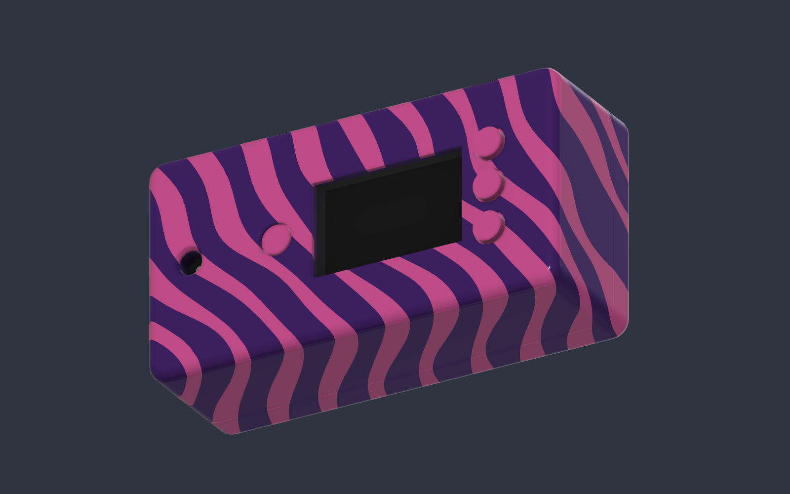

# Producer enclosure

The DidgeLights handheld producer enclosure fits an **Adafruit ESP32-S3 Reverse
TFT Feather (product 5691)**, an **ICS43434 microphone breakout** and a **350 mAh
LiPo**. It includes a screen window, three main buttons, a short flush reset,
a recessed microphone port, and a rear pop-in USB opening.

The mechanical baseline is **Revision 11**. The user reported saving this model
in Fusion on September 24, 2026. Firmware deployment and board support remain
separate from this mechanical release; the root FeatherS2 notes describe a
different board.

## Start here

- [Complete editable Fusion model](revision-11/DidgeLights-enclosure-v11.f3d)
- [Print choices and assembly instructions](revision-11/README.md)
- [Revision 11 verification](revision-11/verification.json)
- [File sizes and SHA-256 hashes](revision-11/bundle-manifest.json)
- [Editing, verification and packaging workflow](WORKFLOW.md)

## Current design

| Item | Design baseline |
| --- | --- |
| Enclosure envelope | Approximately 70.9 × 36.46 × 23.6 mm |
| Battery allowance | User-measured 20 × 38 × 6 mm LiPo, JST connection, rear recess |
| Microphone breakout | User-measured 12.6 × 16.9 × 2.6 mm, opposite Feather USB end |
| Microphone opening | 4 mm throat with 5 mm entrance from a 0.5 mm, 45° recess |
| Rear pop-in USB opening | 14.2 × 5.4 mm, locally reduced to a 2 mm panel thickness |
| On-board USB opening | Removed from case; rear pop-in port retained |
| Fasteners | Two M2 × 20 mm socket-cap screws; recessed head pockets |
| Locating pegs | Tapered, 2.3 mm root / 1.5 mm tip; 2.6 mm receiving holes |
| Colors | Pink/purple organic oblique stripes, flush 0.8 mm exterior regions |

These describe the saved design and supplied measurements, not universal
dimensions for every compatible-looking board or socket. The earlier generic
Feather mounting assumptions were corrected during fitting. Inspect the native
model before changing board mounts.

Revision 11 adds optional one-piece button sets on removable **0.2 mm frames**.
Both flat and domed versions include three main buttons and the short flush reset.
All three standalone plunger variants remain included. Use a 0.2 mm first layer;
cut off and remove the carrier before installing the PCB. See the detailed
assembly instructions. CAD/mesh checks passed; physical carrier behavior still
needs confirmation with the selected filament and print settings.

## File preservation

The 30 files under `revision-11/` were imported byte-for-byte from the verified
Revision 11 print kit. Its original manifest and baseline checks are preserved.
The duplicate ZIP is intentionally ignored; it can be recreated using the
workflow below. Earlier full revisions and scratch experiments remain in the
original local design workspace and are not needed to open the current F3D.

`previous-bambu-project/DidgeLights-v10-H2D.3mf` is explicitly a prior slicer
project, containing loose buttons rather than the new carriers. The user handles
Bambu Studio and printing; the printer used for this project is a Bambu Lab H2D.

## Reference attribution

The electronic board reference is by **Adafruit Industries**, from the
[5691 Feather ESP32-S3 Reverse TFT CAD directory](https://github.com/adafruit/Adafruit_CAD_Parts/tree/main/5691%20Feather%20ESP32%20S3%20Reverse%20TFT).
See Adafruit's [board repository](https://github.com/adafruit/Adafruit-ESP32-S3-Reverse-TFT-Feather-PCB)
for source attribution and licensing. The enclosure is specific to this board;
do not infer that its mounting layout matches every Feather.
